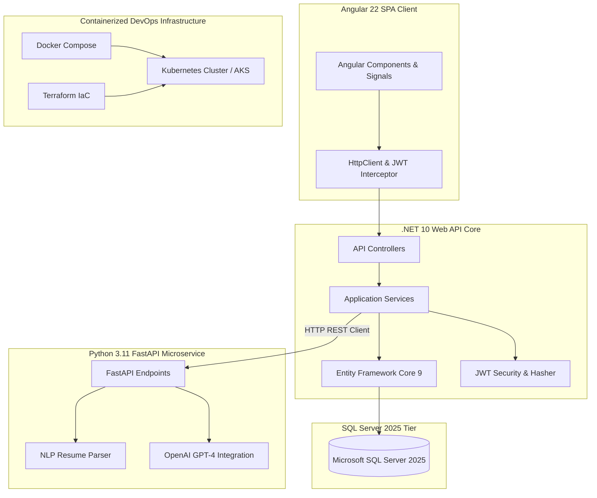

# Smart Recruitment & Resume Screening Platform

<p align="center">
  
</p>

<p align="center">
  
  
  
  
  
  
  
  
</p>

An enterprise-ready **AI-Driven Recruitment Platform** designed for high-scale candidate management, automated resume parsing, job match scoring, and dynamic interview question generation.

---

## 📸 Platform Interface Screenshots

### 📊 1. Recruiter Management Portal
*Comprehensive candidate pipeline tracking, real-time match scoring breakdown, applicant demographics, and top skills distribution.*

<p align="center">
  
</p>

---

### 🤖 2. AI Resume Analysis & Match Scoring Gauge
*NLP-driven resume evaluation engine featuring 0-100 fit score gauge, matched vs. missing skills analysis, candidate recommendation highlights, and auto-generated technical interview questions.*

<p align="center">
  
</p>

---

## 🎯 Executive Summary & Pitch

> *"Smart Recruitment is an end-to-end full-stack hiring application built with ASP.NET Core (.NET 10 LTS Clean Architecture), Angular 22, and a Python FastAPI AI microservice utilizing OpenAI GPT-4. It enables Recruiters to post job openings, manage applicant pipelines, view AI match scores, and generate customized technical interview questions. Candidates can browse positions, upload resumes, receive automated match feedback, and track application statuses. Built for Cognizant interview excellence."*

---

## 🏗️ Architectural Overview & Data Flow



---

## ✨ Core Features & Technical Capability Matrix

| Feature Area | Key Capabilities | Technical Stack |
| :--- | :--- | :--- |
| **Authentication & RBAC** | Stateless JWT Bearer Auth, BCrypt Password Hashing, Candidate vs. Recruiter Policies | ASP.NET Core Security, Angular `AuthGuard` |
| **Job Posting Management** | Full CRUD operations for listings, required skills tagging, filter by department/location | ASP.NET Core Web API, EF Core 9 |
| **AI Resume Parser** | PDF/DOCX text extraction, candidate contact detection, skill recognition | Python 3.11, FastAPI, Regular Expression NLP |
| **Resume-Job Match Engine** | Skill overlap analysis, gap identification, 0-100 score calculation, decision recommendation | Python FastAPI, OpenAI GPT-4 API |
| **Dynamic Interview Question Generator**| Generates customized technical & behavioral interview questions tailored to applicant missing skills | Python FastAPI microservice, .NET HttpClient |
| **Recruiter Portal** | Active job metrics, candidate pipeline table, bulk status updates (Approve/Reject) | Angular 22 Signals, Reactive Forms, CSS Grid |
| **Candidate Portal** | Resume upload, position search, application history tracker, match score feedback | Angular 22 Standalone Components |

---

## 📁 Repository Structure

```
ai-recruitment-platform/
├── backend/
│   ├── Recruitment.Domain/           # Entities, Enums, Repository Interfaces
│   ├── Recruitment.Application/      # DTOs, Business Services, App Interfaces
│   ├── Recruitment.Infrastructure/   # EF Core DbContext, Repositories, JWT, Hasher, AI Client
│   ├── Recruitment.API/              # Controllers, Middleware, Program.cs, Dockerfile
│   ├── Recruitment.Tests/            # xUnit Unit & Integration Tests
│   └── RecruitmentPlatform.sln
├── frontend/
│   └── recruitment-app/              # Angular 22 Standalone SPA
│       ├── src/app/
│       │   ├── core/                 # Auth Guard, JWT Interceptor, Services, Models
│       │   ├── features/             # Auth, Recruiter & Candidate Dashboards, Job CRUD
│       │   └── shared/               # Navbar, Footer, Score Badge
│       └── Dockerfile
├── ai-service/                       # Python FastAPI AI Microservice
│   ├── app/                          # main.py, schemas.py, NLP & LLM services
│   ├── tests/                        # Pytest API test suite
│   └── Dockerfile
├── database/
│   ├── migrations/                   # 001_InitialSchema.sql
│   └── seed/                         # seed_data.sql
├── docs/                             # Architecture, Database, API, and Interview Prep Docs
│   ├── assets/                       # UI Visual Mockups and Screenshots
│   ├── architecture.md
│   ├── database.md
│   ├── api.md
│   └── interview-guide.md
├── infra/
│   ├── terraform/                    # Azure AKS & SQL Server IaC
│   └── kubernetes/                   # Pod Deployments & Ingress Manifests
├── .github/workflows/ci-cd.yml       # GitHub Actions Workflow
├── docker-compose.yml
├── .env.example
└── README.md
```

---

## 🚀 How to Run Locally

### Option 1: Using Docker Compose (Recommended)
```bash
# Clone the repository
git clone https://github.com/saicharanindia/ai-recruitment-platform.git
cd ai-recruitment-platform

# Spin up Database, AI Microservice, .NET Backend, and Angular Frontend
docker-compose up --build
```

Access Points:
- 💻 **Angular 22 Frontend**: `http://localhost:4200`
- ⚡ **ASP.NET Core Web API**: `http://localhost:5000/swagger`
- 🤖 **FastAPI AI Microservice**: `http://localhost:8000/docs`

---

## 🧪 Automated Testing

- **Backend Unit Tests (.NET 10)**:
  ```bash
  dotnet test backend/RecruitmentPlatform.sln
  ```
- **AI Microservice Pytest Suite**:
  ```bash
  cd ai-service && pytest tests/
  ```

---

## 📚 Technical Documentation Links
- 📘 [Architecture & Design Specifications](docs/architecture.md)
- 🗄️ [Database Schema & ER Diagram](docs/database.md)
- 🌐 [REST API Endpoints Specification](docs/api.md)
- 🎓 [Cognizant Interview Preparation Guide](docs/interview-guide.md)
