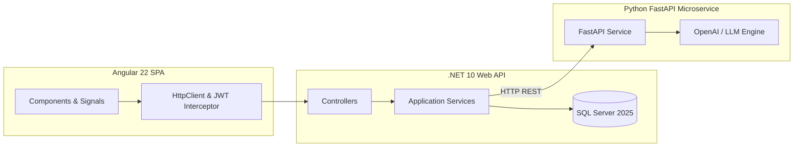

# Smart Recruitment & Resume Screening Platform

[](https://github.com/saicharanindia/ai-recruitment-platform/actions)


An enterprise-ready **AI-Driven Recruitment Platform** designed for high-scale candidate management, automated resume parsing, job match scoring, and dynamic interview question generation.

---

## 🎯 Executive Summary & Pitch

> *"Smart Recruitment is an end-to-end full-stack hiring application built with ASP.NET Core (.NET 10 LTS Clean Architecture), Angular 22, and a Python FastAPI AI microservice utilizing OpenAI GPT-4. It enables Recruiters to post job openings, manage applicant pipelines, view AI match scores, and generate customized technical interview questions. Candidates can browse positions, upload resumes, receive automated match feedback, and track application statuses. Built for Cognizant interview excellence."*

---

## 🏗️ Architectural Overview



### Key Technical Specs:
- **Backend**: C# ASP.NET Core (.NET 10) Clean Architecture (`Recruitment.Domain`, `Recruitment.Application`, `Recruitment.Infrastructure`, `Recruitment.API`, `Recruitment.Tests`).
- **Frontend**: Angular 22 Single Page Application (`recruitment-app`) with Signals, Reactive Forms, Guards, and Interceptors.
- **AI Microservice**: Python 3.11 + FastAPI microservice (`ai-service/`) for NLP resume parsing and resume-to-job matching.
- **Security**: Stateless JWT Bearer tokens + Role-Based Access Control (`Candidate`, `Recruiter`).
- **Database**: Microsoft SQL Server 2025 with Entity Framework Core 9 Code-First context.
- **DevOps**: Docker, `docker-compose.yml`, Kubernetes manifests (`infra/kubernetes/`), Terraform IaC (`infra/terraform/`), and GitHub Actions CI/CD workflow (`.github/workflows/ci-cd.yml`).

---

## 📁 Repository Structure

```
ai-recruitment-platform/
├── backend/
│   ├── Recruitment.Domain/           # Entities, Enums, Repository Interfaces
│   ├── Recruitment.Application/      # DTOs, Business Services, App Interfaces
│   ├── Recruitment.Infrastructure/   # EF Core DbContext, Repositories, JWT, Hasher, AI Client
│   ├── Recruitment.API/              # Controllers, Middleware, Program.cs, Dockerfile
│   ├── Recruitment.Tests/            # xUnit Unit & Integration Tests
│   └── RecruitmentPlatform.sln
├── frontend/
│   └── recruitment-app/              # Angular 22 Standalone SPA
│       ├── src/app/
│       │   ├── core/                 # Auth Guard, JWT Interceptor, Services, Models
│       │   ├── features/             # Auth, Recruiter & Candidate Dashboards, Job CRUD
│       │   └── shared/               # Navbar, Footer, Score Badge
│       └── Dockerfile
├── ai-service/                       # Python FastAPI AI Microservice
│   ├── app/                          # main.py, schemas.py, NLP & LLM services
│   ├── tests/                        # Pytest API test suite
│   └── Dockerfile
├── database/
│   ├── migrations/                   # 001_InitialSchema.sql
│   └── seed/                         # seed_data.sql
├── docs/                             # Architecture, Database, API, and Interview Prep Docs
│   ├── architecture.md
│   ├── database.md
│   ├── api.md
│   └── interview-guide.md
├── infra/
│   ├── terraform/                    # Azure AKS & SQL Server IaC
│   └── kubernetes/                   # Pod Deployments & Ingress Manifests
├── .github/workflows/ci-cd.yml       # GitHub Actions Workflow
├── docker-compose.yml
├── .env.example
└── README.md
```

---

## 🚀 How to Run Locally

### Option 1: Using Docker Compose (Recommended)
```bash
# Clone the repository
git clone https://github.com/saicharanindia/ai-recruitment-platform.git
cd ai-recruitment-platform

# Spin up Database, AI Microservice, .NET Backend, and Angular Frontend
docker-compose up --build
```
Access points:
- **Angular Frontend**: `http://localhost:4200`
- **ASP.NET Core Web API**: `http://localhost:5000/swagger`
- **AI Microservice**: `http://localhost:8000/docs`

### Option 2: Running Components Individually

1. **Database**:
   Run `database/migrations/001_InitialSchema.sql` and `database/seed/seed_data.sql` on your local SQL Server instance.

2. **AI Microservice**:
   ```bash
   cd ai-service
   python -m venv venv
   source venv/bin/activate  # or venv\Scripts\activate on Windows
   pip install -r requirements.txt
   uvicorn app.main:app --reload --port 8000
   ```

3. **Backend API**:
   ```bash
   cd backend/Recruitment.API
   dotnet run
   ```

4. **Angular Frontend**:
   ```bash
   cd frontend/recruitment-app
   npm install
   npm start
   ```

---

## 🧪 Testing

- **Run .NET Unit Tests**:
  ```bash
  dotnet test backend/RecruitmentPlatform.sln
  ```
- **Run Python Pytest Suite**:
  ```bash
  cd ai-service && pytest tests/
  ```

---

## 📚 Technical Documentation links
- [Architecture & Design Specs](docs/architecture.md)
- [Database Schema & ER Diagram](docs/database.md)
- [REST API Endpoints Specification](docs/api.md)
- [Cognizant Interview Preparation Guide](docs/interview-guide.md)
