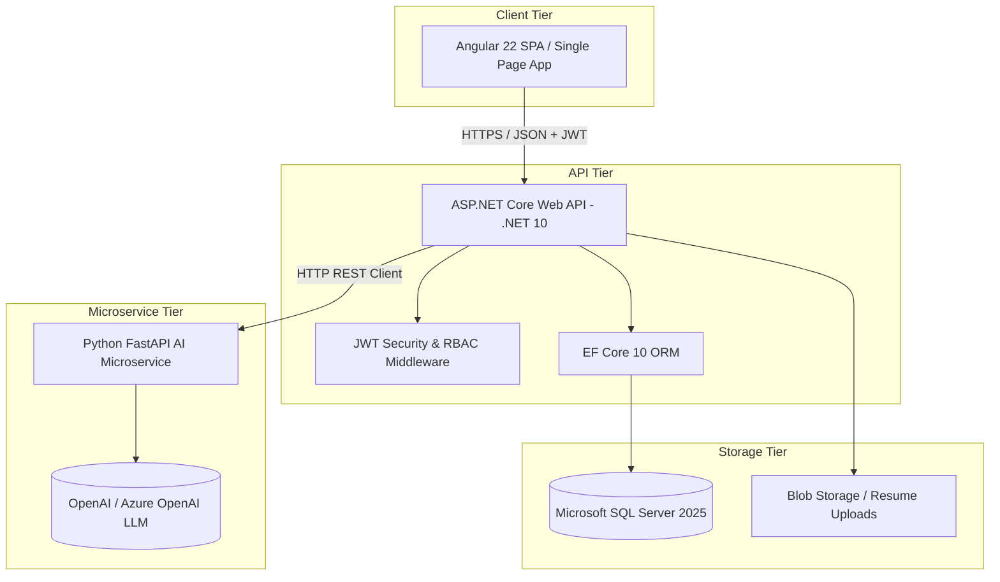

# Architecture Overview - Smart Recruitment Platform

## System Architecture Diagram

## Clean Architecture Layers (.NET 10)

1. **Recruitment.Domain**: Core business entities (`User`, `Job`, `Candidate`, `Application`, `AiMatch`, `InterviewQuestion`), value objects, enums, and repository interfaces. Clean C# with zero external framework dependencies.
2. **Recruitment.Application**: Application logic, DTO definitions, Command/Query services, validation rules, mapping logic, and interface abstractions (`IAuthService`, `IJobService`, `IApplicationService`, `IAiService`).
3. **Recruitment.Infrastructure**: External implementations including `RecruitmentDbContext` (EF Core SQL Server), Repositories implementation, JWT Token Generator, BCrypt Password Hasher, and `AiServiceClient` (HttpClient for Python service).
4. **Recruitment.API**: ASP.NET Core Web API Controllers, Exception Handling Middleware, Dependency Injection container configuration, and OpenAPI/Swagger specs.

## AI Microservice Integration Flow

1. Candidate uploads resume -> API saves file and passes text content to Python FastAPI `/parse-resume`.
2. FastAPI processes text using NLP/LLM schemas and returns structured JSON (skills, experience, education).
3. When candidate applies to a job, backend sends resume JSON + job description JSON to FastAPI `/match`.
4. FastAPI evaluates skill overlap, semantic fit, calculates a score (0-100), and identifies matched vs missing skills.
5. Recruiter can trigger `/generate-questions` to get customized technical and behavioral interview questions tailored specifically to the candidate's missing skills and background.
