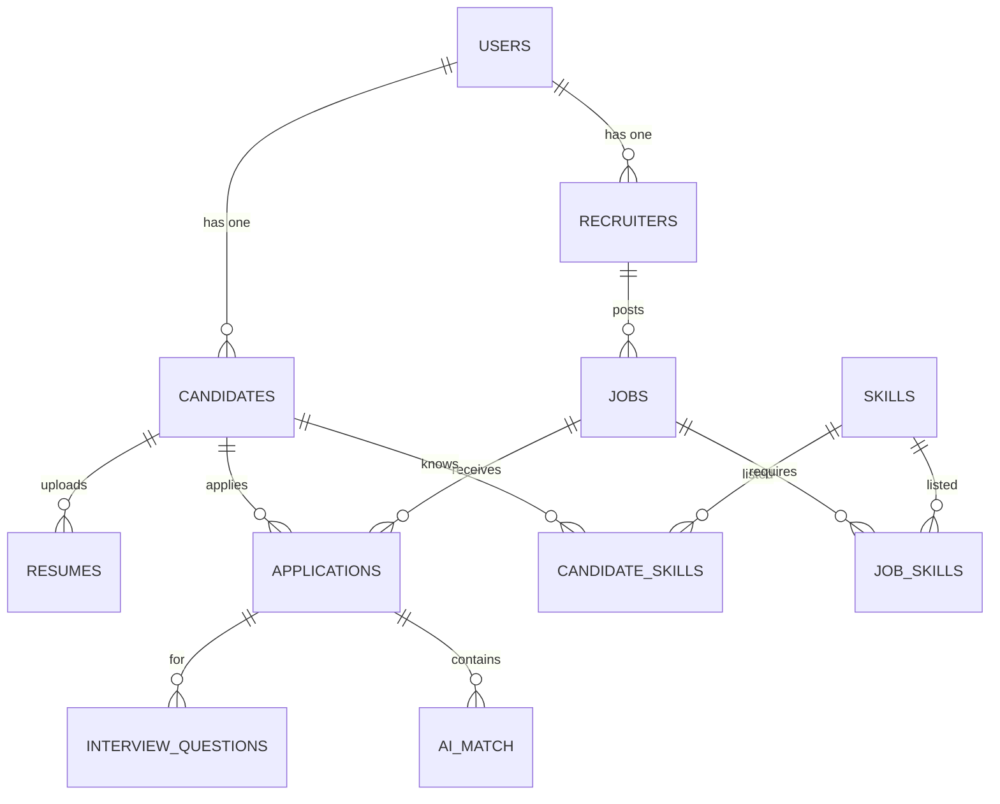

# Database Specification & Entity-Relationship Schema

## ER Diagram

## Entity Descriptions & Data Dictionary

| Table | Column | Type | Constraints | Description |
|-------|--------|------|-------------|-------------|
| **Users** | UserId | INT | PK, IDENTITY | Unique user identifier |
| | FullName | NVARCHAR(150) | NOT NULL | User's full display name |
| | Email | NVARCHAR(150) | UNIQUE, NOT NULL | Login email address |
| | PasswordHash | NVARCHAR(256) | NOT NULL | BCrypt hashed password |
| | Role | NVARCHAR(50) | CHECK (Candidate, Recruiter) | RBAC Role |
| | CreatedAt | DATETIME2 | DEFAULT GETUTCDATE() | Registration timestamp |
| **Jobs** | JobId | INT | PK, IDENTITY | Job posting ID |
| | RecruiterId | INT | FK -> Recruiters | Posting recruiter |
| | Title | NVARCHAR(200) | NOT NULL | Position title |
| | Department | NVARCHAR(100) | NOT NULL | Org department |
| | IsActive | BIT | DEFAULT 1 | Active status flag |
| **Applications** | ApplicationId | INT | PK, IDENTITY | Candidate job application |
| | JobId | INT | FK -> Jobs | Target job |
| | CandidateId | INT | FK -> Candidates | Applying candidate |
| | Status | NVARCHAR(50) | CHECK (Pending, Shortlisted, Rejected) | Status lifecycle |
| **AI_Match** | MatchId | INT | PK, IDENTITY | AI evaluation record |
| | ApplicationId | INT | FK -> Applications, UNIQUE | Application link |
| | MatchScore | INT | CHECK (0-100) | Match score percentage |
| | MatchedSkills | NVARCHAR(MAX) | JSON string | List of matched skills |
| | MissingSkills | NVARCHAR(MAX) | JSON string | List of skill gaps |
